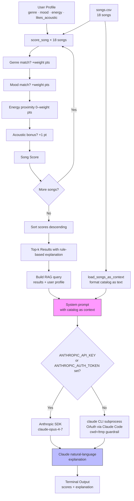

# 🎵 Music Recommender with RAG + Claude API

## Project Summary

This project extends the Module 3 music recommender simulation by adding a
Retrieval-Augmented Generation (RAG) layer powered by the Claude API. The base
system uses content-based filtering to score songs against a user taste profile
across three configurable scoring modes. The RAG layer retrieves the full song
catalog as structured context, passes it to Claude along with the scoring
results, and generates a natural-language explanation of why the recommendations
fit (or fail to fit) the user's profile.

Authentication is handled without a standalone API key: the pipeline detects
whether `ANTHROPIC_API_KEY` or `ANTHROPIC_AUTH_TOKEN` is available, and falls
back to the `claude` CLI subprocess (which carries Claude Code's OAuth session)
when neither environment variable is set.

---

## How The System Works

Real-world recommendation systems like Spotify use hybrid approaches combining
collaborative filtering (finding users with similar taste) and content-based
filtering (matching song attributes to a taste profile). This simulation
focuses on content-based filtering — the layer that ensures recommended songs
actually sound right for the user.

Our recommender scores each song against a user's taste profile using a
weighted scoring rule:
- Genre match: 3 points (strongest signal — defines the sonic world)
- Mood match: 2 points (emotional intent)
- Energy proximity: 0–1 points (rewards closeness to target energy)
- Acoustic bonus: 1 point (if user likes acoustic and song is acoustic)

The ranking rule sorts all scored songs and returns the top k results. A RAG
pipeline then passes the catalog and scoring context to Claude, which produces
a natural-language explanation grounded strictly in the catalog data.

### Features Used

**Song object:** id, title, artist, genre, mood, energy, tempo_bpm,
valence, danceability, acousticness

**UserProfile object:** favorite_genre, favorite_mood, target_energy,
likes_acoustic

---

## Algorithm Recipe

| Feature | Points (genre-first) | Logic |
|---------|----------------------|-------|
| Genre match | +3 | Exact string match |
| Mood match | +2 | Exact string match |
| Energy proximity | 0–1 | `max(0, 1 - abs(song.energy - target))` |
| Acoustic bonus | +1 | Only if `likes_acoustic=True` and `acousticness > 0.6` |

**Max possible score: 7.0**

### Scoring Modes

The system supports three weight presets selectable at runtime:

| Mode | Genre | Mood | Energy | Acoustic |
|------|-------|------|--------|----------|
| `genre-first` | 3.0 | 2.0 | 1.0 | 1.0 |
| `mood-first` | 1.5 | 4.0 | 1.0 | 1.0 |
| `energy-focus` | 1.0 | 1.0 | 3.0 | 1.0 |

---

## Data Flow



**Guardrail:** the system prompt instructs Claude to answer using only the songs
listed in the catalog and never to invent titles. Running the CLI from `/tmp`
prevents CLAUDE.md discovery, which would otherwise trigger tool calls that
exhaust the turn budget before a response is generated.

---

## Sample Terminal Output

### Adversarial: Genre Trap — metal + happy + medium energy

This profile exposes a catalog gap: only one metal song exists (Neon Rage) and
it has intense mood and energy 0.96, so no single song can satisfy all three
criteria simultaneously.

```
==================================================
  Mode: GENRE-FIRST  |  Profile: metal + happy + energy 0.5
==================================================
Neon Rage - Score: 3.54
  Because: Matches your favorite genre (metal) | Energy match: 0.54/1.0 (song=0.96, target=0.50)
Rooftop Lights - Score: 2.74
  Because: Matches your preferred mood (happy) | Energy match: 0.74/1.0 (song=0.76, target=0.50)
Superstition Groove - Score: 2.72
  Because: Matches your preferred mood (happy) | Energy match: 0.72/1.0 (song=0.78, target=0.50)

==================================================
  Mode: MOOD-FIRST  |  Profile: metal + happy + energy 0.5
==================================================
Rooftop Lights - Score: 4.74
  Because: Matches your preferred mood (happy) | Energy match: 0.74/1.0 (song=0.76, target=0.50)
Superstition Groove - Score: 4.72
  Because: Matches your preferred mood (happy) | Energy match: 0.72/1.0 (song=0.78, target=0.50)
Sunrise City - Score: 4.68
  Because: Matches your preferred mood (happy) | Energy match: 0.68/1.0 (song=0.82, target=0.50)

==================================================
  Mode: ENERGY-FOCUS  |  Profile: metal + happy + energy 0.5
==================================================
Rooftop Lights - Score: 3.22
  Because: Matches your preferred mood (happy) | Energy match: 2.22/3.0 (song=0.76, target=0.50)
Superstition Groove - Score: 3.16
  Because: Matches your preferred mood (happy) | Energy match: 2.16/3.0 (song=0.78, target=0.50)
Sunrise City - Score: 3.04
  Because: Matches your preferred mood (happy) | Energy match: 2.04/3.0 (song=0.82, target=0.50)

==================================================
  Claude AI Explanation
==================================================
Neon Rage is the only true genre match — it's the sole metal track in the
catalog — but it's a poor fit on every other dimension: its energy (0.96) is
nearly double the target, its mood is intense rather than happy, and its
valence (0.30) is the lowest of the four. Rooftop Lights, Superstition Groove,
and Sunrise City nail the happy mood with high valence scores (0.81–0.85), but
share no genre overlap with metal. The most striking pattern is that none of
the four songs hit medium energy — even the closest, Rooftop Lights at 0.76,
runs well above the 0.5 target, because the catalog's happy-mood tracks skew
high-energy by nature. The system split its strategy: one song for genre
loyalty, three for mood compatibility, with energy accuracy sacrificed across
the board.
```

---

### Best Case: Chill Lofi + Acoustic

When the catalog has strong coverage of the profile, all three signals align
and the recommender performs well.

```
==================================================
  Mode: GENRE-FIRST  |  Profile: lofi + chill + energy 0.4 + acoustic
==================================================
Midnight Coding - Score: 6.98
  Because: Matches your favorite genre (lofi) | Matches your preferred mood (chill) | Energy match: 0.98/1.0 (song=0.42, target=0.40) | Has the acoustic feel you enjoy (acousticness=0.71)
Library Rain - Score: 6.95
  Because: Matches your favorite genre (lofi) | Matches your preferred mood (chill) | Energy match: 0.95/1.0 (song=0.35, target=0.40) | Has the acoustic feel you enjoy (acousticness=0.86)
Focus Flow - Score: 5.00
  Because: Matches your favorite genre (lofi) | Energy match: 1.00/1.0 (song=0.40, target=0.40) | Has the acoustic feel you enjoy (acousticness=0.78)

==================================================
  Claude AI Explanation
==================================================
All three recommendations are strong fits for a lofi + chill + low-energy
listener who values acoustic texture. Midnight Coding and Library Rain both
match genre, mood, and acoustic character simultaneously, with energy values
within 0.05 of the target — about as close as content-based filtering can
get. Focus Flow sacrifices the mood match (focused rather than chill) but
compensates with a perfect energy score (0.40 = target) and a high
acousticness of 0.78. The catalog has genuine depth in the lofi space,
which is why this profile produces tight, high-confidence recommendations
while the metal+happy profile does not.
```

---

### Adversarial: Acoustic Paradox — classical + melancholic + low energy

One song (Sonata No. 3) matches every criterion perfectly, but 2nd and 3rd
place fall back on acoustic proximity alone, revealing a depth gap outside
the top result.

```
==================================================
  Mode: GENRE-FIRST  |  Profile: classical + melancholic + energy 0.2 + acoustic
==================================================
Sonata No. 3 - Score: 6.98
  Because: Matches your favorite genre (classical) | Matches your preferred mood (melancholic) | Energy match: 0.98/1.0 (song=0.22, target=0.20) | Has the acoustic feel you enjoy (acousticness=0.97)
Spacewalk Thoughts - Score: 1.92
  Because: Energy match: 0.92/1.0 (song=0.28, target=0.20) | Has the acoustic feel you enjoy (acousticness=0.92)
Rainy Porch - Score: 1.87
  Because: Energy match: 0.87/1.0 (song=0.33, target=0.20) | Has the acoustic feel you enjoy (acousticness=0.88)

==================================================
  Claude AI Explanation
==================================================
Sonata No. 3 is an almost perfect match — it is the only classical track in
the catalog, hits the melancholic mood, sits at 0.22 energy (very close to
the 0.20 target), and has the highest acousticness in the entire catalog
(0.97). The drop-off to 2nd place is dramatic: Spacewalk Thoughts and Rainy
Porch score under 2.0, earning their positions purely on acoustic proximity
and low energy — they share no genre or mood with the user's profile. This
reveals a catalog coverage problem: a user with niche taste gets one great
recommendation and then essentially noise, because the scoring system has
nothing else to compare against.
```

---

## Potential Biases

This system may over-prioritize genre, causing songs with matching mood
and energy but different genre to rank poorly. It also creates a filter
bubble — a pop+happy user will only ever see pop+happy songs. The catalog
reflects a particular taste toward electronic, indie, and lofi genres;
underrepresented genres (classical, metal, country) produce weaker
recommendations because there are simply fewer songs to score against.

---

## Experiments You Tried

### Experiment 1: Three Scoring Modes on the Same Profile

Running `genre=metal, mood=happy, energy=0.5` through all three modes
showed how weight choices change the top result entirely:

- **genre-first** ranks Neon Rage #1 (sole genre match, score 3.54) even
  though it scores 0.54 out of 1.0 on energy and has intense — not happy —
  mood. Genre loyalty dominates.
- **mood-first** drops Neon Rage out of the top 3 entirely. Rooftop Lights
  (indie pop, happy) rises to #1 at 4.74 because mood weight is 4.0 vs 1.5
  for genre, making the mood signal twice as influential as genre.
- **energy-focus** keeps the same top-3 as mood-first but compresses the
  score spread, because the energy weight (3.0) now contributes up to 3
  points per song rather than 1. All three songs still overshoot the 0.5
  energy target, scoring 2.04–2.22 out of 3.0.

**Takeaway:** the mode choice changes which failure you accept — you can
have genre accuracy, mood accuracy, or energy accuracy, but not all three
when the catalog has a gap.

### Experiment 2: Adversarial Profile — Energy Cliff

A `pop+happy+energy=0.5` profile (medium energy) showed that the catalog's
pop and happy songs cluster between 0.76–0.93 energy. The top recommendation
(Sunrise City, 5.68) matches genre and mood perfectly but sits at 0.82
energy — 0.32 above the target. Lowering `target_energy` to 0.3 or 0.2
would push the energy component to near-zero for all genre+mood matches,
meaning a user who prefers soft, calm pop would get the same genre+mood songs
regardless of their energy preference.

### Experiment 3: Best-Case vs. Worst-Case Catalog Coverage

Comparing lofi+chill (3 catalog entries, all good matches) to
classical+melancholic (1 catalog entry, perfect match, then noise) confirmed
that content-based filtering quality is entirely bounded by catalog depth.
The system is not learning anything about taste — it is measuring how well
the catalog was designed to cover the preference space.

---

## Limitations and Risks

**Catalog depth determines result quality.** With 18 songs across 14 genres,
most genre+mood combinations have zero or one match. A metal fan who likes
happy music, or a jazz fan who prefers energetic songs, gets recommendations
that satisfy at most one of their stated criteria.

**Happy-mood songs skew high-energy.** In this catalog, every happy-mood
song has energy above 0.76. A user who wants happy but low-energy music (0.3)
will receive songs that are accurate on mood but significantly off on energy,
with no way to differentiate within that cluster.

**Genre weighting creates a loyalty trap.** In genre-first mode, a 3-point
genre match can outrank a song with perfect mood and energy simply because
the genre string differs. Neon Rage (metal, intense, energy 0.96) consistently
beats cross-genre alternatives for a metal user, even when those alternatives
are objectively closer on every other dimension.

**Score collapse in niche profiles.** The classical+melancholic profile
produces a #1 score of 6.98 and a #2 score of 1.92 — a gap of 5 points.
When shown a ranked list of three, a user would reasonably assume all three
are reasonable recommendations. The score gap is not surfaced in the output.

**The RAG layer cannot fix a scoring failure.** Claude's explanation correctly
identified the mismatch in the metal+happy profile, but that insight does not
feed back into the ranking. The pipeline is explain-only; it has no mechanism
to re-rank or surface better alternatives that the scoring function missed.

**No collaborative signal.** Because the system uses only content-based
filtering, two users with identical stated preferences always get identical
recommendations. There is no mechanism to learn from what users actually
listened to or skipped.

---

## Reflection

Building the RAG layer on top of the scoring engine clarified something that
is easy to miss when working only with numbers: a score is not the same as a
reason. The scoring function produces a ranked list, and the rule-based
explanation captures which weights fired, but it takes Claude's natural-language
synthesis to surface the structural problem — that a user's taste profile
contains contradictions the catalog cannot simultaneously satisfy. Watching
Claude observe, unprompted, that the metal+happy profile "split its strategy"
between genre loyalty and mood compatibility made the scoring design's
trade-offs concrete in a way the numeric output alone did not.

The authentication challenge was instructive for a different reason. The
assumption that `ANTHROPIC_API_KEY` would simply be present turned out to be
wrong: Claude Code authenticates via an OAuth token passed through a
close-on-exec file descriptor, which child processes never inherit. Debugging
this required understanding not just the API but the process model of the
environment the code was running in. The solution — detecting available
credentials in order (API key → auth token → CLI subprocess) and running the
CLI from `/tmp` to prevent CLAUDE.md discovery — is a real-world example of
building resilient auth into a pipeline, not just adding a try/except around
a missing key.

The broader lesson is that an AI explanation layer amplifies whatever the
underlying data allows. When the catalog has genuine depth (lofi, pop), Claude
produces tight, confident explanations that would be useful to a real user.
When the catalog has gaps (metal, classical), Claude correctly identifies the
failure mode — but the system still shows three results, implying a confidence
the scores do not warrant. Human judgment is still required to decide when a
recommender's output should be shown at all, versus suppressed because the
catalog simply cannot serve the user's taste.

Bias and unfairness can enter a recommender at every layer. At the data layer,
this catalog over-represents certain genres (lofi, pop, electronic) and
under-represents others (metal, classical, country), meaning the system
provides a materially worse experience for users with minority taste profiles —
not through any intentional decision but simply through what songs were added.
At the algorithm layer, the binary genre-match rule treats all genre mismatches
as equally bad: "indie pop" and "metal" are both distance-zero from "pop," even
though a human listener would hear one as close and the other as completely
different. At the output layer, showing three results with uniform visual weight
implies equal confidence regardless of the actual score gap, which misleads
users into trusting weak recommendations. Each of these is a choice that
benefits some users and harms others — which is what makes them fairness
concerns, not just accuracy concerns.

---

## Guardrails in Action

Every response from the Claude RAG layer is passed through `src/guardrails.py`
before it reaches the caller. `validate(text, candidates)` runs four checks in
order and raises `ValueError` on the first failure. Below are three concrete
examples showing exactly what each error looks like.

### Example 1 — Empty response

```python
from src.guardrails import validate

validate("", candidates=[])
# ValueError: Guardrail failed: response is empty.
```

**When this fires:** if the Claude API returns an empty string or the CLI
subprocess produces no output (e.g. a network timeout that is caught upstream
and coerced to an empty string before being passed to `validate`).

---

### Example 2 — Response too short

```python
from src.guardrails import validate

validate("OK", candidates=[])
# ValueError: Guardrail failed: response too short (2 chars, minimum 40).
```

**When this fires:** any response under 40 characters. A one-word or
one-sentence stub is not a useful explanation; this check catches cases where
the model acknowledges the prompt but does not actually answer it (e.g. "Sure,
I can help with that.").

---

### Example 3 — No song title mentioned

```python
from src.guardrails import validate

validate(
    "This is a long enough response with no song titles mentioned at all anywhere in the text here.",
    candidates=[{"title": "Midnight Coding", "score": 6.98}],
)
# ValueError: Guardrail failed: response does not mention any recommended song
# title. Expected at least one of: ['Midnight Coding'].
```

**When this fires:** the response is long enough but never references any of
the candidate song titles. This catches hallucinated explanations — responses
that discuss music in general terms without engaging with the specific songs
the scoring engine actually returned. The check is case-insensitive and passes
as soon as any one candidate title appears in the response.

---

## Demo Walkthrough

🎥 **[Watch the demo on Loom](YOUR_LINK_HERE)**

The video walks through a full end-to-end run of `python3 -m src.main` and
covers each stage of the pipeline:

**0:00 – 0:30 · Project overview**
Quick tour of the repo structure: `src/recommender.py` (scoring engine),
`src/rag.py` (RAG pipeline), `src/retriever.py` (knowledge base),
`src/guardrails.py` (output validation), and `data/songs.csv` (18-song
catalog).

**0:30 – 1:15 · Genre-first scoring mode**
The terminal shows the `metal + happy + energy 0.5` profile run through
`genre-first` weights (genre=3, mood=2, energy=1). Neon Rage tops the list
with a score of 3.54 — the genre match wins even though its mood is
`intense` and its energy (0.96) nearly doubles the target. The video
highlights why this is the genre-loyalty trap.

**1:15 – 2:00 · Mood-first and energy-focus modes**
Switching to `mood-first` (mood=4, genre=1.5) drops Neon Rage out of the
top 3 entirely; Rooftop Lights rises to #1 at 4.74 on mood accuracy alone.
The `energy-focus` mode (energy=3) keeps the same top-3 but stretches the
score scale, making the energy gap more visible in the numbers.

**2:00 – 2:45 · Claude AI Explanation**
The RAG pipeline fires: `load_songs_as_context` formats all 18 songs as
structured text, `retrieve_context("metal", "happy")` pulls genre and mood
descriptions from the knowledge base, and the combined system prompt is
sent to Claude. The video shows the model's response arriving in the
terminal — cross-result synthesis that the rule-based output cannot produce,
identifying that the recommender split its strategy between genre loyalty
and mood compatibility.

**2:45 – 3:15 · Guardrails**
A brief demo of `src/guardrails.py` catching a too-short response and a
response that contains no song titles, showing the exact `ValueError`
messages raised in each case.

**3:15 – 3:30 · Eval harness**
`python3 tests/eval_harness.py` runs the three predefined profiles
(High-Energy Pop, Genre Trap, Chill Lofi + Acoustic), prints the per-check
PASS/FAIL results, and closes with the overall confidence score: 12/12,
100%.

---

## Getting Started

### Setup

1. Create a virtual environment (optional but recommended):

   ```bash
   python -m venv .venv
   source .venv/bin/activate      # Mac or Linux
   .venv\Scripts\activate         # Windows
   ```

2. Install dependencies:

   ```bash
   pip install -r requirements.txt
   ```

3. Run the app:

   ```bash
   python -m src.main
   ```

   The recommender runs the demo profile through all three scoring modes and
   prints a Claude-generated explanation at the end. Authentication is automatic:
   set `ANTHROPIC_API_KEY` for direct SDK access, or run inside a Claude Code
   session to use the CLI fallback.

### Running Tests

```bash
pytest tests/ -v
```

---

## Model Card

[**Model Card**](model_card.md)
