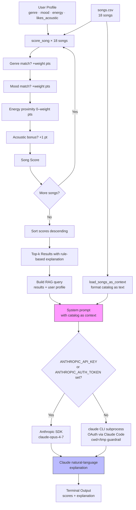

# System Diagram — Music Recommender with RAG + Claude API

```mermaid
flowchart TD
    A[User Profile\ngenre · mood · energy · likes_acoustic] --> C[score_song × 18 songs]
    B[songs.csv\n18 songs] --> C
    C --> D[Genre match? +weight pts]
    D --> E[Mood match? +weight pts]
    E --> F[Energy proximity 0–weight pts]
    F --> G[Acoustic bonus? +1 pt]
    G --> H[Song Score]
    H --> I{More songs?}
    I -- Yes --> C
    I -- No --> J[Sort scores descending]
    J --> K[Top-k Results with rule-based explanation]

    B --> L[load_songs_as_context\nformat catalog as text]
    K --> M[Build RAG query\nresults + user profile]
    L --> N[System prompt\nwith catalog as context]
    M --> N
    N --> O{ANTHROPIC_API_KEY\nor ANTHROPIC_AUTH_TOKEN set?}
    O -- Yes --> P[Anthropic SDK\nclaude-opus-4-7]
    O -- No --> Q[claude CLI subprocess\nOAuth via Claude Code\ncwd=/tmp guardrail]
    P --> R[Claude natural-language\nexplanation]
    Q --> R
    R --> S[Terminal Output\nscores + explanation]

    style N fill:#f9f,stroke:#333
    style R fill:#bbf,stroke:#333
```
